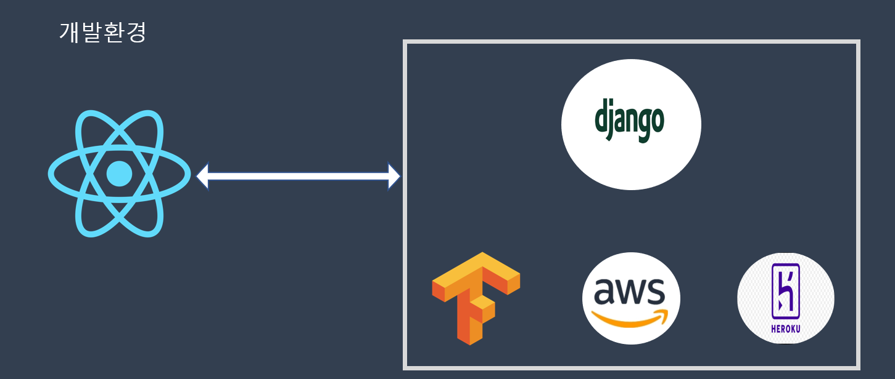
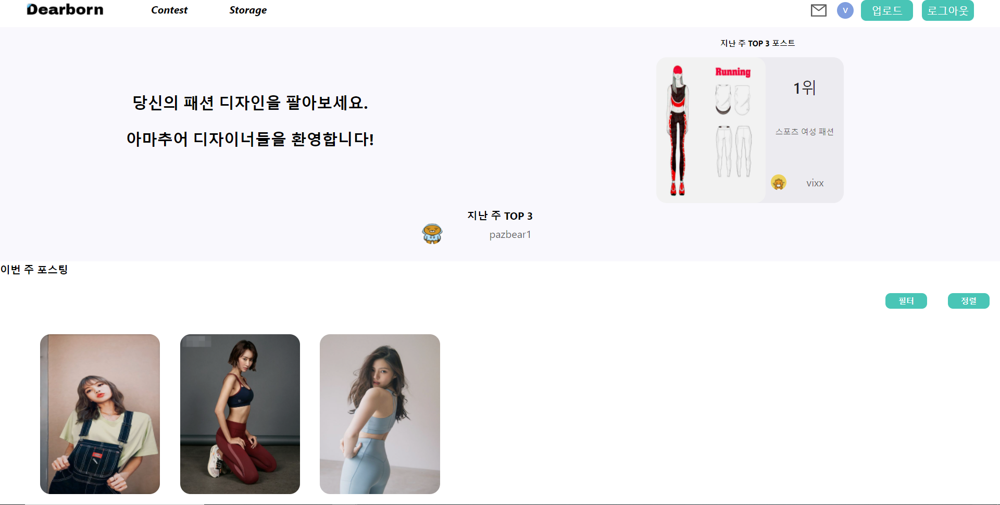
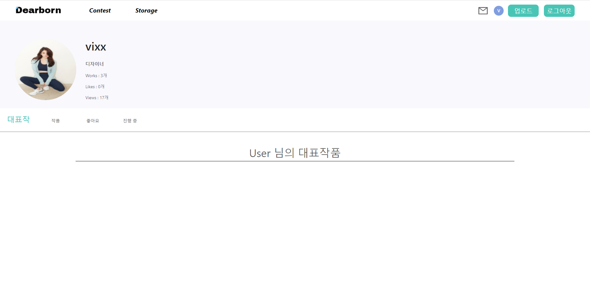
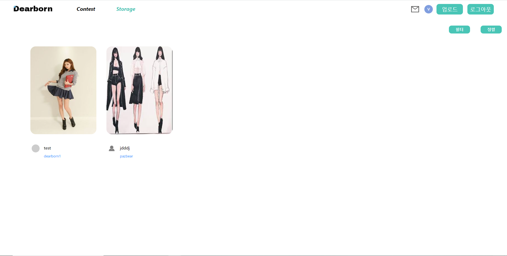

<p align='middle'>


<h1 align='middle'><a href='https://dearborn.herokuapp.com'>Dearborn</a></h1>
<p align='middle'>
패션디자이너를 위한 <u>🙆‍♂️🙅‍♀️웹 기반 중개 플랫폼</u>이에요.<br>
 전공자 뿐만 아니라 비전공자도 할 수 있어요.<br>
디어본으로 많은 작품을 보여주세요 😊
</p>

---

## 목차

- [목차](#목차)
- [👨‍👨‍👧팀원 소개](#팀원-소개)
  - [report](#report)
- [프로젝트 소개](#프로젝트-소개)
  - [:wrench:사용 기술](#wrench사용-기술)
  - [:file_folder:Backend](#file_folderbackend)
    - [:iphone:App](#iphoneapp)
    - [:package:Config](#packageconfig)
  - [:minidisc:사이트](#minidisc사이트)
  - [📌프로젝트 목표](#프로젝트-목표)
    - [💻🤳](#)
    - [♻ two](#-two)
    - [💪 three](#-three)
    - [🌈 four](#-four)
- [👨‍💻실행 방법](#실행-방법)
  - [설치](#설치)
  - [실행](#실행)
- [api키](#api키)

---

## 👨‍👨‍👧팀원 소개

<table>
  <tr>
  <td align="center">
  <sub>
    백엔드 및 서버
  </sub>
  </td>
  <td align="center">
  <sub>
    백엔드 및 텐서플로
  </sub>
  </td>
  <td align="center">
  <sub>
    프론트엔드
  </sub>
  </td>
  </tr>
  <tr>
    <td align="center"><a href="https://github.com/VIXXPARK"><br /><sub><b>박수한</b></sub></a><br /></td>
    <td align="center"><a href="https://github.com/HJinS"><br /><sub><b>허진수</b></sub></a><br /></td>
    <td align="center"><a href="https://github.com/Pazbear"><br /><sub><b>조민관</b></sub></a><br /></td>
  </tr>
    <tr>
  <td align="center">
    <a href="">조장</a></sub>
  </td>
  <td align="center">
    <sub>
    <a href="">조원</a>
    </sub>
  </td>
  <td align="center">
    <sub>
    <a href="">조원</a></sub>
  </td>
  </tr>
</table>

### report


---

## 프로젝트 소개

### :wrench:사용 기술

> 

<p align='middle'><a href='' align='middle'></a></p>

### :file_folder:Backend
<strong>Backend Architecture</strong></br>
<p align='middle'><a href='' align='middle'></a></p>

#### :iphone:App
- <a href="./backend/dearbornApp">dearbornApp</a></br>
  사이트 기능들을 담당하고 있으며 모델,시리얼라이저,url,views 기능 별로 폴더를 구분하였다.</br>
  앱들의 기능들은 :heavy_check_mark:평가(assess),:heavy_dollar_sign:거래(bid),댓글(comment),:fireworks:공모전(contest),:envelope:메신저,:scroll:포스트(post),:bust_in_silhouette:커스텀한 유저(user)로 되어있다.</br>
  - <a href="./backend/dearbornApp/models">models</a></br>
  - <a href="./backend/dearbornApp/serializers">serializers</a></br>
  - <a href="./backend/dearbornApp/urls">urls</a></br>
  - <a href="./backend/dearbornApp/views">views</a></br>

#### :package:Config
- <a href="./backend/dearbornConfig">dearbornConfig</a></br>
  - <a href="./backend/dearbornConfig/settings">base</a></br>
  - <a href="./backend/dearbornConfig/settings">local</a></br>
  - <a href="./backend/dearbornConfig/settings">production</a></br>

---

### :minidisc:사이트 

<p align='middle'><a href='' align='middle'></a></p>
</br> 
<p align='middle'><a href='' align='middle'></a></p> 
</br>
<p align='middle'><a href='' align='middle'></a></p> 
</br>

---
### 📌프로젝트 목표

#### 💻🤳 

- 
- 

#### ♻ two

- 
- 

#### 💪 three

- 

#### 🌈 four

- 
- 
- 

---

## 👨‍💻실행 방법

>   
> 

### 설치

```shell
pip install -r requirements.txt
```

### 실행

```shell
py manage.py runserver --settings=dearbornConfig.settings.local
```

---

## api키

